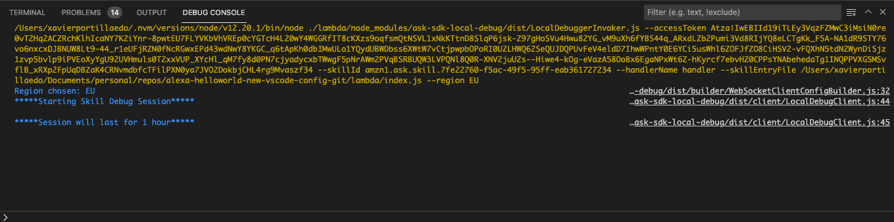

# New VS Code Debugging Tools for Alexa

During the last months, the Alexa Team has launched a bunch of useful tools for Visual Studio Code. The purpose of these new features is to have a single place with everything set up. Also having all these tools in the same place, we do not have to switch between multiple apps or tabs. In this article I will show you how you can have a full dev env for Alexa Skills on Visual Studio Code

<!-- TOC -->

- [New VS Code Debugging Tools for Alexa](#new-vs-code-debugging-tools-for-alexa)
  - [Prerequisites](#prerequisites)
  - [Setting up our Alexa Skill](#setting-up-our-alexa-skill)
  - [Creating the Visual Studio Configuration](#creating-the-visual-studio-configuration)
  - [Alexa Simulator](#alexa-simulator)
  - [Launching and debugging our Alexa Skill locally](#launching-and-debugging-our-alexa-skill-locally)
  - [Video with the full explanation](#video-with-the-full-explanation)
  - [Resources](#resources)
  - [Conclusion](#conclusion)

<!-- /TOC -->

## Prerequisites

Here you have the technologies used in this project
1. Node.js v14.x
2. Visual Studio Code
3. Alexa Extension on VS Code

## Setting up our Alexa Skill

The first step we need to do to enable local debugging on our Visual Studio Code is basically just adding 2 packages npm: `ask-sdk-model` and `ask-sdk-local-debug`. The first one you should already have it, but it is worth it to upgrade it to the latest version. You should use `v1.29.0` or higher!

The second package, `ask-sdk-local-debug`, is the most important one, this is a `devDependency` instead of a normal `dependency`. Why? well, we just need it only for development purposes. This package is the one that we are going to use to launch our AWS Lambda locally and intercept all the calls from the Alexa Cloud Service.

To install these dependencies you have to run these commands:
1. For npm:
```bash
    npm install --save ask-sdk-model@^1.29.0
    npm install --save-dev ask-sdk-local-debug
```
2. For yarn:
```bash
    yarn add ask-sdk-model@^1.29.0
    yarn add ask-sdk-local-debug --dev
```

With these packages installed/updated we have done good progress on this journey!! Let's continue with the following steps.

## Creating the Visual Studio Configuration

Once we have the packages we need installed/upgraded, we need to create a Visual Studio configuration to launch our AWS Lambda.

All the Visual Studio configurations should be placed down `.vscode` folder. In this folder we are going to create a file called `launch.json`:

```json

    {
        "version": "0.2.0",
        "configurations": [
            {
                "name": "Debug Alexa Skill (Node.js)",
                "type": "node",
                "request": "launch",
                "program": "${command:ask.debugAdapterPath}",
                "args": [
                    "--accessToken",
                    "${command:ask.accessToken}",
                    "--skillId",
                    "${command:ask.skillIdFromWorkspace}",
                    "--handlerName",
                    "handler",
                    "--skillEntryFile",
                    "${workspaceFolder}/lambda/index.js",
                    "--region",
                    "EU"
                ]
            }
        ]
    }

```

Let's explain a little bit deeper the most relevant parameters that we have in this configuration that we called `Debug Alexa Skill (Node.js)`:
1. `program`: this parameter auto-detects the launcher program that we need to run our AWS Lambda locally. This program was installed when we installed the `ask-sdk-local-debug` package.
2. arguments:
   1. `accessToken`: this is the token we need to intercept the Alexa Skill invocations locally
   2. `skillId`: the id of our Alexa Skill
   3. `handlerName`: the name of the object created on our AWS Lambda that will get all the invocations
   4. `skillEntryFile`: where is the handler located (In which file).
   5. `region`; the region of **YOUR** Alexa developer account. I set to EU because my account is from Europe. The available values are NA(North America), FE(Far East), EU(Europe).

Creating this configuration you will be able to run your AWS directly on your VS Code from the debug tab:


And you will se this output on your Debug Console:



After this, you can set up all the breakpoints you want.

## Alexa Simulator

When you install the Alexa Extension on your VS Code you will see the Alexa icon on the left sidebar. Clicking there you will see a lot of options that you can use for your daily development like downloading the interaction model, APL viewer, downloading the Skill manifest, deploying your Alexa Skill or directly testing your Skill within VS Code:


If we click on the Simulator, we will have a screen very similar to the Test tab on the Alexa Developer Console but now on your IDE!


Having these nice tools properly set, it's time to launch our Alexa Skill and see if the code stops on the breakpoints.

## Launching and debugging our Alexa Skill locally

When we invocate the Alexa skill from the Simulator and you have run your AWS Lambda locally you will start seeing that all the interactions are intercepting:


So this means that the code that is executing is the code that we have on our lambda folder locally! Let's put some breakpoints and see if that works:


**voilà**

## Video with the full explanation

And that's it, here you have the full explanation in an Alexa Office EU Hours session with me and Gaetano Ursomano from the Alexa team.

[](https://www.youtube.com/watch?v=9g1grjLBZOc)


## Resources
* [Official Alexa Skills Kit Node.js SDK](https://www.npmjs.com/package/ask-sdk) - The Official Node.js SDK Documentation
* [Official Alexa Skills Kit Documentation](https://developer.amazon.com/docs/ask-overviews/build-skills-with-the-alexa-skills-kit.html) - Official Alexa Skills Kit Documentation

## Conclusion 

As you can see the amazon team has created nice tools to have everything in the same ecosystem. Looking forward to seeing what you are going to develop!

I hope this example project is useful to you.

That's all folks!

Happy coding!
